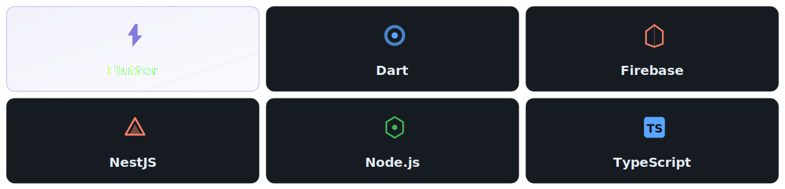
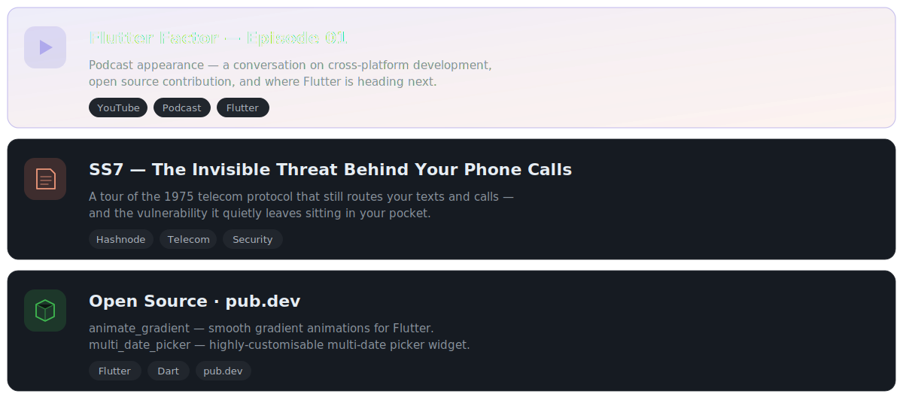

  

 

### ─  TRANSMISSION

**Senior Software Engineer III** at **[GeekyAnts](https://www.geekyants.com/)**, Bangalore. Primary orbit: **Flutter** — cross-platform mobile apps, client delivery, and open-source packages shipped to [pub.dev](https://pub.dev/packages?author=vikaskumar75).

Where I spend extra cycles: the gnarly altitudes of mobile — **Firebase Cloud Messaging** that actually arrives, **deep links** surviving cold-start re-entry, custom painters locked at 60fps. Off-screen I write on [Hashnode](https://vikaskumar75.hashnode.dev/) about telecom and mobile security, and turn up on podcasts like [Flutter Factor](https://www.youtube.com/watch?v=ScWqjWW9c6E) when invited.

Fueled by automation, keyboard-driven workflows, and Claude Code.

 

### ─  TECH CONSTELLATION

  

 

### ─  ACTIVE MISSIONS

  

 

### ─  MISSION LOG

<b>▸ &nbsp; Workflow & tools I live in</b>

 

**AeroSpace** (tiling WM) · **Karabiner-Elements** · **lazygit** · **Claude Code** (Sonnet / Opus / Haiku model switching) · **Arc** browser · **macOS** · Neovim-adjacent keybindings everywhere.

No mouse if I can help it. The shorter the loop between thought and shipped code, the better.

<b>▸ &nbsp; Things I've shipped or taught</b>

 

- **Flutter security training** — JWT, OAuth 2.0 / PKCE, OWASP Mobile Top 10
- **Next.js developer training** for incoming engineers
- **Technical interview design** for senior Flutter engineers
- **Chant Football** — fan-engagement mobile platform · Flutter · Firebase · Node.js
- More open-source work brewing — watch [pub.dev/packages?author=vikaskumar75](https://pub.dev/packages?author=vikaskumar75)

 

### ─  SIGNAL STRENGTH

  

 

<picture>
  <source media="(prefers-color-scheme: dark)" srcset="https://github-readme-activity-graph.vercel.app/graph?username=Vikaskumar75&custom_title=orbital%20trajectory&bg_color=0d1117&color=7f77dd&line=7f77dd&point=ffffff&area_color=7f77dd&area=true&hide_border=true">
  <source media="(prefers-color-scheme: light)" srcset="https://github-readme-activity-graph.vercel.app/graph?username=Vikaskumar75&custom_title=orbital%20trajectory&bg_color=ffffff&color=7f77dd&line=7f77dd&point=1F2328&area_color=7f77dd&area=true&hide_border=true">
  
</picture>

  

### ─  OPEN FREQUENCIES

  
  &nbsp;
  
  &nbsp;
  
  &nbsp;
  

 

---

  This README was forged in the void — an animated SVG hero, real <code>&lt;details&gt;</code> mission logs, and a palette borrowed from the night sky.
   
  Last signal · May 2026 · Delhi → Bangalore

